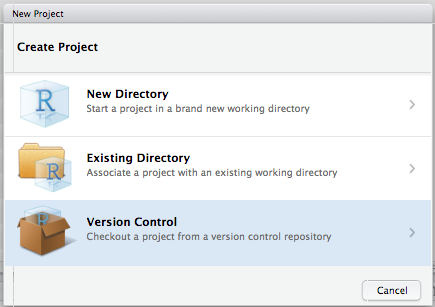

# Prerequisites

- Install R
- Install RStudio
- Install Git
    - Help resources for various operating system: <https://happygitwithr.com/install-git.html> 
    - If you aren't sure, try this:
        - Open a terminal: "RStudio >> Tools >> Terminal >> New Terminal"
        - After the dollar sign prompt enter these two commands
            - `which git`
            - `git --version`
        - If git is installed, the result will indicate where it is located and what version you are using
        - Once you have it installed carry on to the next section.

A more complete guide to configuring Git(Hub) and RStudio is available at <https://happygitwithr.com/>, but the work-aid below is generally sufficient for most of our purposes.

# In GitHub...

0. Create GitHub user id (if you haven't done so already)
    - I recommend you use some derivative of your actual name (mine is `mdbeckman`)
    - Choose a name that you are comfortable sharing during a job interview 
    - Better yet if it's a name that is *recognizable* as you (e.g. a psu id like `mdb268` is fine, but NOT recognizable to those outside Penn State)
1. Log in
2. Create Repo for your project (or navigate to an existing Repo)
3. Click the green button "Clone or Download" and then Copy the URL shown below

 

# In RStudio...

4. Log in
5. Select "File >> New Project" OR Click on the "Project" menu shown in the upper right corner of the RStudio Window

 

6. Select "Version Control"

 

7. Select "Git"

 

8. Establish the connection (Clone Git Repository)
    - "Repository URL": Paste the URL that you previously copied from GitHub
    - "Project Directory Name": This will be the name of a new folder (i.e. directory) on **your computer**. Use the same name as your GitHub Repo (e.g. mine was "Informative-Repo-Name" here). 
    - "Create Project as a Subdirectory Of": This is the location on **your computer** for the new folder. For example, I recommend that you make a folder for all of your STAT 380 projects and then put this Repo (and others for STAT 380) together in that directory.

 

9. You're in! (hopefully)... note the following
    - the "Project" menu shown in the upper right corner of the RStudio Server Window now shows the name of my Repo/Project (e.g. mine was "Informative-Repo-Name" in this case)
    - a new "Git" tab appears and has started tracking file changes in my Repo. The two files shown (".gitignore" and something ending in ".RProj") basically help Git & RStudio handle logistics, just "commit" and "push" them.
        - select the check boxes to "stage" the changes... only the files you select will be part of this commit
        - Select "Commit"
        - A new window pops up where you should enter an informative commit message and look over the "Diff"... if there were a previous committed version of the file, the Diff summarizes all changes since
        - DONT FORGET TO PUSH!! The changes aren't on the Git Remote (i.e. GitHub) until you PUSH them!!

 

10. From here on, nearly everything (~90-95%) of your workflow can happen in RStudio... at least in STAT 380
    - First, click PULL to get the latest copy of your files from the Git Remote (*very* important if you have a collaborator)
    - Edit files just like always
    - When you "save" or add a new file, it will show up in the "Git" tab in RStudio
    - When you're ready to preserve a snapshot, "Commit" the changes (always review the Diff and add an *informative* commit message)
    - DONT FORGET TO PUSH!!!

 

11. (optional) Suppress Git from prompting your username & password
    - see <http://happygitwithr.com/>
    - You need to do this in a Terminal or Shell window in RStudio (either one works)
        - RStudio >> Tools >> Terminal >> New Terminal
        - RStudio >> Tools >> Shell
    - One line at a time, enter these three commands at the prompt ($) in the terminal / shell 
        - `git config --global user.name 'Aaron Carlson'`
        - `git config --global user.email 'abc1234@psu.edu'`
        - `git config --global --list`
    - The last command `git config --global --list` should verify that Git now recognizes your name, email and credential helper.
    - Set credentials & verify
        - In RStudio, open a project connected to a GitHub repo
        - "PULL" in the 'Git' tab of RStudio
        - enter your credentials when prompted
        - "PULL" a second time in the 'Git' tab of RStudio
            - you should no longer be prompted for credentials
            - if prompted for credentials on the second "PULL" carefully follow the instructions again or see <http://happygitwithr.com/>

 

# Help

12. If (when) you encounter problems look here first...
    - <http://happygitwithr.com/>
    - Google it!
    - Google it again with different search terms!
    - Ask a question on the class Piazza site
    - Visit office hours

